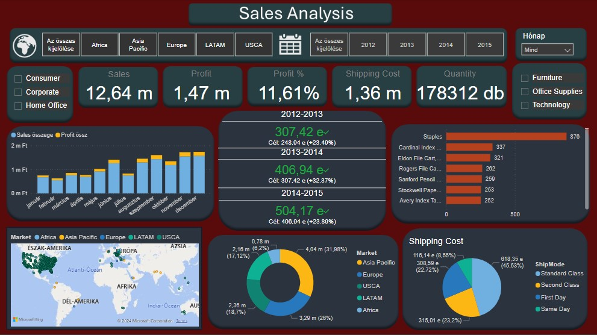
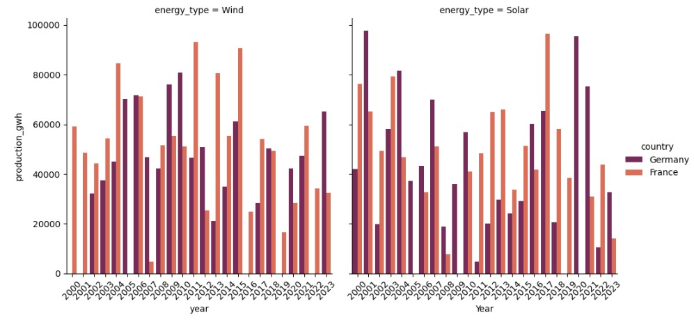
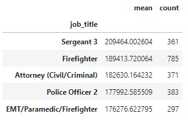
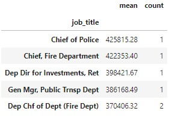

# Introduction
**I made these projects in order to practice and to further develop the skills I learned during my university courses.**
# [Power BI Project](https://github.com/rfanni324/power-bi-project)
### About the data: 
The data was provided by my university teacher. I assembled the necessary data and cleaned it in excel power pivot. I made KPIs and other calculations in excel but I also had to add to it in Power BI too.

# Data Analysis Projects
### *With Jupyter Notebook*
# [Renewable energy](https://github.com/rfanni324/energy-p1)

### About the data:
- database is from [kaggle](https://www.kaggle.com/datasets/anishvijay/global-renewable-energy-and-indicators-dataset/data)
- 56 columns and 2500 lines 

### Work process:

**Setting the goal of the analysis:**
  - Comparing France an Germany based on data related to solar and wind energy

**Data Cleaning and Preparation:**
  - Checking data types
  - Narrowing down the database
  - Removing unnecessary columns
  - Checking/removing duplicate and null values
  - Resetting indexes
  - Renaming columns

**Data Exploration and Analysis:**
  - Creating visualizations: charts, graph
  - Descriptive statistics: max, min, average

# [Salaries](https://github.com/rfanni324/salaries-p2)

### About the data:
- data was provided by my university teacher
- 13 columns 148654 lines
- columns: Id(int64), EmployeeName(object), JobTitle(object), BasePay(float64), OvertimePay(float64), OtherPay(float64), Benefits(float64), TotalPay(float64), TotalPayBenefits(float64), Year(int64), Notes(float64), Agency(object), Status(float64)

### Work process:

**Setting the goal of the analysis:**
*in 2013 and 2014:*
  - Identifying employees with the highest and lowest total salaries
  - Determining job positions with the highest total salary, base pay, and overtime compensation
  - Highest combined salary, base pay, and overtime compensation by job position

**Data Cleaning and Preparation:**
  - Checking data types
  - Narrowing down the database
  - Removing unnecessary columns
  - Checking/removing duplicate and null values
  - Resetting indexes
  - Renaming columns

**Data Exploration and Analysis:**
  - Descriptive statistics: max, min, average
  - Creating visualizations: charts, graphs

